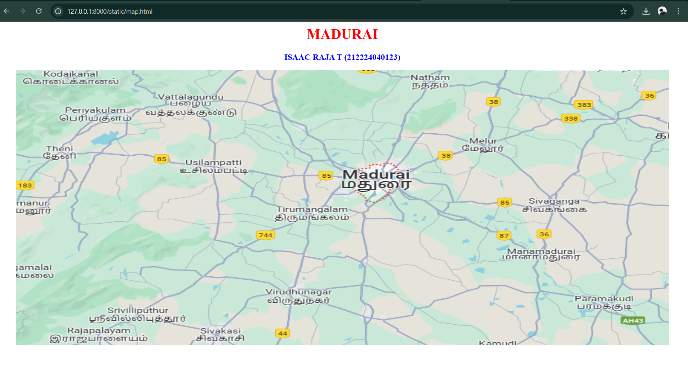
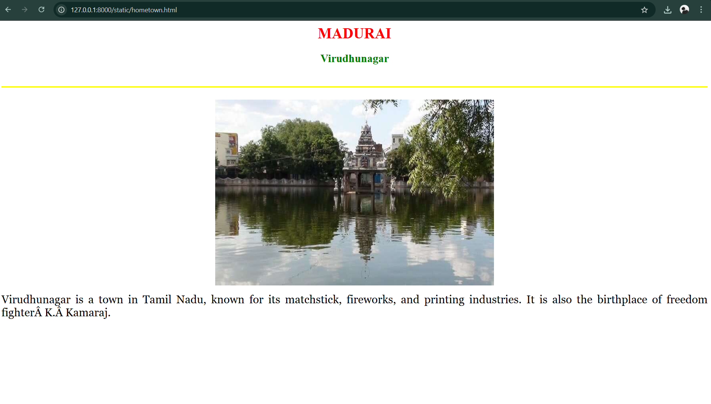
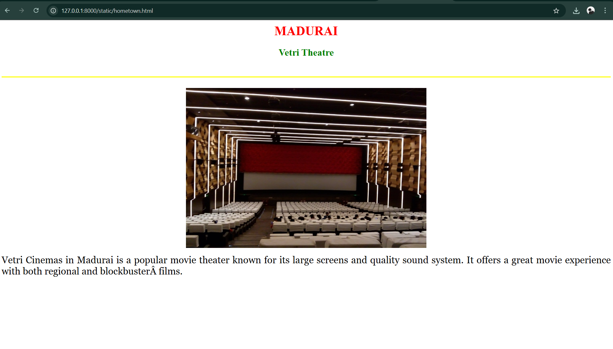
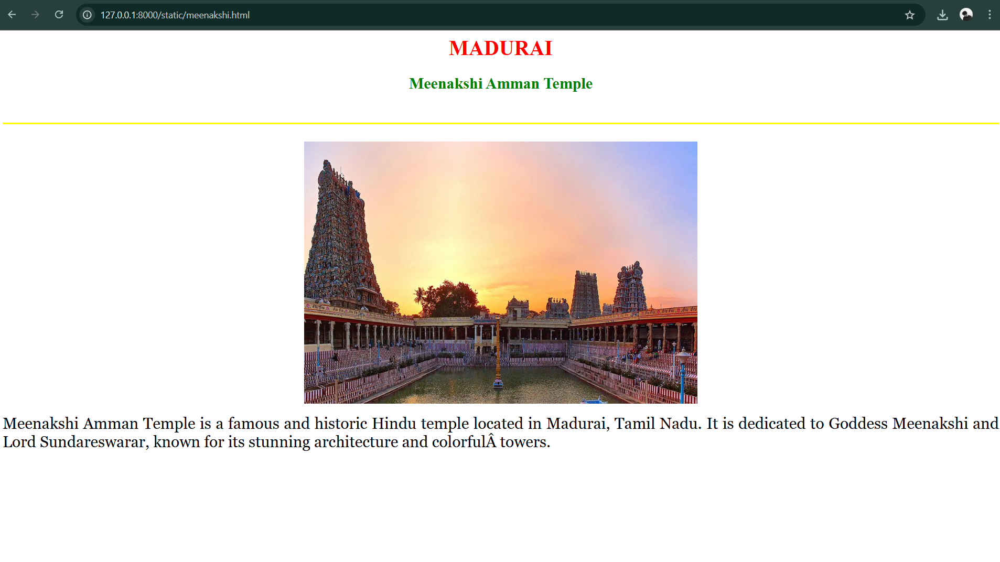
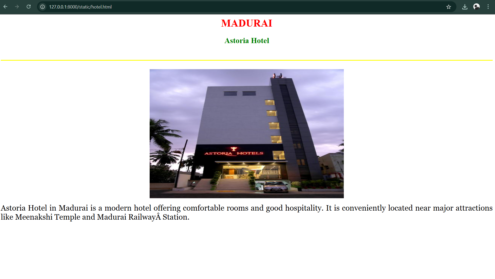
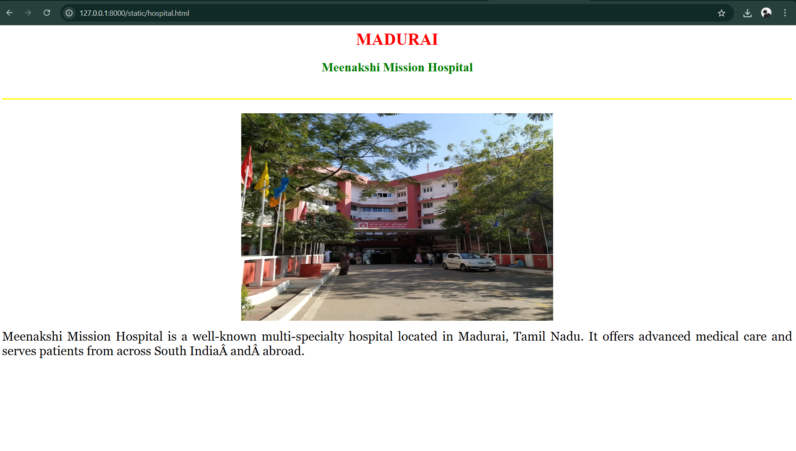

# Ex04 Places Around Me
## Date: 23/04/2025

## AIM
To develop a website to display details about the places around my house.

## DESIGN STEPS

### STEP 1
Create a Django admin interface.

### STEP 2
Download your city map from Google.

### STEP 3
Using ```<map>``` tag name the map.

### STEP 4
Create clickable regions in the image using ```<area>``` tag.

### STEP 5
Write HTML programs for all the regions identified.

### STEP 6
Execute the programs and publish them.

## CODE
```
map.html

<html>
    <head>
        <title>My City</title>
    </head>
    <body>
        <h1 align="center">
            <font color="red"><b>MADURAI</b></font>
        </h1>
        <h3 align="center">
            <font color="blue"><b>ISAAC RAJA T (212224040123)</b></font>
        </h3>
        <center>
            
            <map name="MyCity">
                <area target="" alt="Hospital" title="Hospital" href="hospital.html" coords="698,365,913,496" shape="rect">
                <area target="" alt="hometown" title="hometown" href="hometown.html" coords="250,360,220,100" shape="circle">
                <area target="" alt="theatre" title="theatre" href="theatre.html" coords="700,250,600,300" shape="rect">
                <area target="" alt="meenakshi" title="meenakshi" href="meenakshi.html" coords="580,300,50,50" shape="circle">
                <area target="" alt="hotel" title="hotel" href="hotel.html" coords="60,60,150,150" shape="rect">
                <area target="" alt="" title="" href="" coords="" shape="0">
    
            </map>
        </center>  
    </body>
</html>

hometown.html

<html>
    <head>
        <title>My City</title>
    </head>
    <body>
        <h1 align="center">
            <font color="red"><b>MADURAI</b></font>
        </h1>
        <h2 align="center">
            <font color="green"><b>Virudhunagar</b></font>
        </h2>
        <br>
        <hr size="3" color="yellow">
        <br>
        <center>
        </center>
        <p align="justify">
            <font face="Georgia" size="5" color="black">
                
                Virudhunagar is a town in Tamil Nadu, known for its matchstick, fireworks, and printing industries. It is also the birthplace of freedom fighter K. Kamaraj.
                
            </font>
        </p>
    </body>

hotel.html

<html>
    <head>
        <title>My City</title>
    </head>
    <body>
        <h1 align="center">
            <font color="red"><b>MADURAI</b></font>
        </h1>
        <h2 align="center">
            <font color="green"><b>Astoria Hotel</b></font>
        </h2>
        <br>
        <hr size="3" color="yellow">
        <br>
        <center>
        </center>
        <p align="justify">
            <font face="Georgia" size="5" color="black">
                
                Astoria Hotel in Madurai is a modern hotel offering comfortable rooms and good hospitality. It is conveniently located near major attractions like Meenakshi Temple and Madurai Railway Station.
            </font> 
        </p>
    </body>
</html>

hospital.html

<html>
    <head>
        <title>My City</title>
    </head>
    <body>
        <h1 align="center">
            <font color="red"><b>MADURAI</b></font>
        </h1>
        <h2 align="center">
            <font color="green"><b>Meenakshi Mission Hospital</b></font>
        </h2>
        <br>
        <hr size="3" color="yellow">
        <br>
        <center>
        </center>
        <p align="justify">
            <font face="Georgia" size="5" color="black">
                
                Meenakshi Mission Hospital is a well-known multi-specialty hospital located in Madurai, Tamil Nadu. It offers advanced medical care and serves patients from across South India and abroad.
            </font>
        </p>
    </body>
</html>

meenakshi.html

<html>
    <head>
        <title>My City</title>
    </head>
    <body>
        <h1 align="center">
            <font color="red"><b>MADURAI</b></font>
        </h1>
        <h2 align="center">
            <font color="green"><b>Meenakshi Amman Temple</b></font>
        </h2>
        <br>
        <hr size="3" color="yellow">
        <br>
        <center>
        </center>
        <p align="justify">
            <font face="Georgia" size="5" color="black">
                
                Meenakshi Amman Temple is a famous and historic Hindu temple located in Madurai, Tamil Nadu. It is dedicated to Goddess Meenakshi and Lord Sundareswarar, known for its stunning architecture and colorful towers.
            </font>
        </p>
    </body>
</html>

theatre.html


    <html>
        <head>
            <title>My City</title>
        </head>
        <body>
            <h1 align="center">
                <font color="red"><b>MADURAI</b></font>
            </h1>
            <h2 align="center">
                <font color="green"><b>Vetri Theatre</b></font>
            </h2>
            <br>
            <hr size="3" color="yellow">
            <br>
            <center>
            </center>
            <p align="justify">
                <font face="Georgia" size="5" color="black">
                    
                    Vetri Cinemas in Madurai is a popular movie theater known for its large screens and quality sound system. It offers a great movie experience with both regional and blockbuster films.
                </font> 
            </p>
        </body>
    </html>
</html>
```

## OUTPUT









## RESULT
The program for implementing image maps using HTML is executed successfully.
